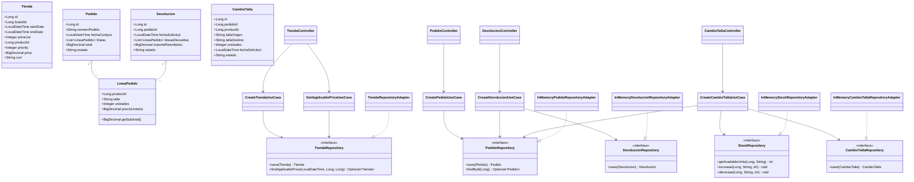

# Diagrama de clases actualizado

```mermaid
classDiagram
    class Tienda {
      +Long id
      +Long brandId
      +LocalDateTime startDate
      +LocalDateTime endDate
      +Integer priceList
      +Long productId
      +Integer priority
      +BigDecimal price
      +String curr
    }

    class Pedido {
      +Long id
      +String numeroPedido
      +LocalDateTime fechaCompra
      +List~LineaPedido~ lineas
      +BigDecimal total
      +String estado
    }

    class LineaPedido {
      +Long productId
      +String talla
      +Integer unidades
      +BigDecimal precioUnitario
      +BigDecimal getSubtotal()
    }

    class Devolucion {
      +Long id
      +Long pedidoId
      +LocalDateTime fechaSolicitud
      +List~LineaPedido~ lineasDevueltas
      +BigDecimal importeReembolso
      +String estado
    }

    class CambioTalla {
      +Long id
      +Long pedidoId
      +Long productId
      +String tallaOrigen
      +String tallaDestino
      +Integer unidades
      +LocalDateTime fechaSolicitud
      +String estado
    }

    class TiendaRepository {
      <<interface>>
      +save(Tienda) Tienda
      +findApplicablePrice(LocalDateTime, Long, Long) Optional~Tienda~
    }

    class PedidoRepository {
      <<interface>>
      +save(Pedido) Pedido
      +findById(Long) Optional~Pedido~
    }

    class DevolucionRepository {
      <<interface>>
      +save(Devolucion) Devolucion
    }

    class CambioTallaRepository {
      <<interface>>
      +save(CambioTalla) CambioTalla
    }

    class StockRepository {
      <<interface>>
      +getAvailableUnits(Long, String) int
      +increase(Long, String, int) void
      +decrease(Long, String, int) void
    }

    class CreateTiendaUseCase
    class GetApplicablePriceUseCase
    class CreatePedidoUseCase
    class CreateDevolucionUseCase
    class CreateCambioTallaUseCase

    class TiendaController
    class PedidoController
    class DevolucionController
    class CambioTallaController

    class TiendaRepositoryAdapter
    class InMemoryPedidoRepositoryAdapter
    class InMemoryDevolucionRepositoryAdapter
    class InMemoryCambioTallaRepositoryAdapter
    class InMemoryStockRepositoryAdapter

    Pedido "1" o-- "*" LineaPedido
    Devolucion "1" o-- "*" LineaPedido

    CreateTiendaUseCase --> TiendaRepository
    GetApplicablePriceUseCase --> TiendaRepository
    CreatePedidoUseCase --> PedidoRepository
    CreateDevolucionUseCase --> PedidoRepository
    CreateDevolucionUseCase --> DevolucionRepository
    CreateCambioTallaUseCase --> PedidoRepository
    CreateCambioTallaUseCase --> StockRepository
    CreateCambioTallaUseCase --> CambioTallaRepository

    TiendaController --> CreateTiendaUseCase
    TiendaController --> GetApplicablePriceUseCase
    PedidoController --> CreatePedidoUseCase
    DevolucionController --> CreateDevolucionUseCase
    CambioTallaController --> CreateCambioTallaUseCase

    TiendaRepositoryAdapter ..|> TiendaRepository
    InMemoryPedidoRepositoryAdapter ..|> PedidoRepository
    InMemoryDevolucionRepositoryAdapter ..|> DevolucionRepository
    InMemoryCambioTallaRepositoryAdapter ..|> CambioTallaRepository
    InMemoryStockRepositoryAdapter ..|> StockRepository
```
